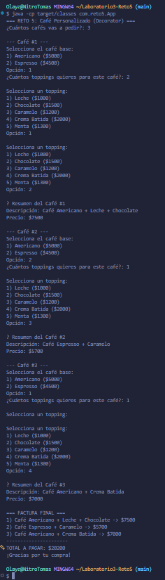

## Reto 5 - El Café Personalizado

### Categoría del Patrón
Estructural

### Patrón Utilizado
Decorator

### Justificación
Se requiere agregar toppings (leche, chocolate, caramelo, etc.) a un café de forma dinámica sin modificar la clase base del café.
El patrón Decorator permite extender el comportamiento (descripción y costo) envolviendo el objeto Coffee con decoradores.

### Cómo lo apliqué
- Componente: Coffee (interface con description() y cost()).
- Componentes concretos: Americano y Espresso.
- Decorador abstracto: ToppingDecorator (mantiene una referencia a Coffee).
- Decoradores concretos: Leche, Chocolate, Caramelo, CremaBatida, Menta.
- App.java: permite crear varios cafés, agregar X toppings por café, mostrar resumen y calcular total con streams.